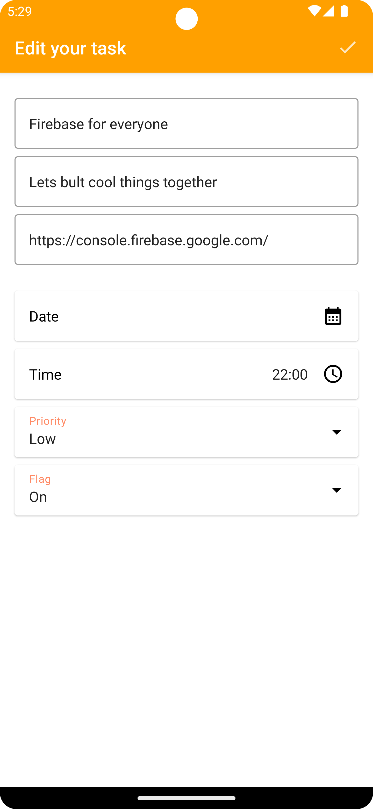

# Quick

A simple Todo App that demonstrates how to use Firebase Authentication, Crashlytics, Cloud Firestore
and Hilt with Jetpack Compose UI

### Download

If you want to clone the repo, open a terminal and type a git checkout command:

github.com/mtali/Quick

## :nut_and_bolt: Setting up

In order for this app to work, you will need to create a Firebase project:

- Clone this repository
- Create a Firebase project in the Firebase Console
- Follow these steps to register Make it Quick in your Firebase project
- Follow these steps to add the Firebase Android configuration file to Make it So
- Create a Cloud Firestore database in your Firebase project
- Enable Anonymous Authentication in your Firebase project
- Enable Email/Password Authentication in your Firebase project

<br/>

## :camera_flash: Screenshots

<p align="center">




</p>

## License

```
MIT License

Copyright (c) 2021 fundroid

Permission is hereby granted, free of charge, to any person obtaining a copy
of this software and associated documentation files (the "Software"), to deal
in the Software without restriction, including without limitation the rights
to use, copy, modify, merge, publish, distribute, sublicense, and/or sell
copies of the Software, and to permit persons to whom the Software is
furnished to do so, subject to the following conditions:

The above copyright notice and this permission notice shall be included in all
copies or substantial portions of the Software.

THE SOFTWARE IS PROVIDED "AS IS", WITHOUT WARRANTY OF ANY KIND, EXPRESS OR
IMPLIED, INCLUDING BUT NOT LIMITED TO THE WARRANTIES OF MERCHANTABILITY,
FITNESS FOR A PARTICULAR PURPOSE AND NONINFRINGEMENT. IN NO EVENT SHALL THE
AUTHORS OR COPYRIGHT HOLDERS BE LIABLE FOR ANY CLAIM, DAMAGES OR OTHER
LIABILITY, WHETHER IN AN ACTION OF CONTRACT, TORT OR OTHERWISE, ARISING FROM,
OUT OF OR IN CONNECTION WITH THE SOFTWARE OR THE USE OR OTHER DEALINGS IN THE
SOFTWARE.
```